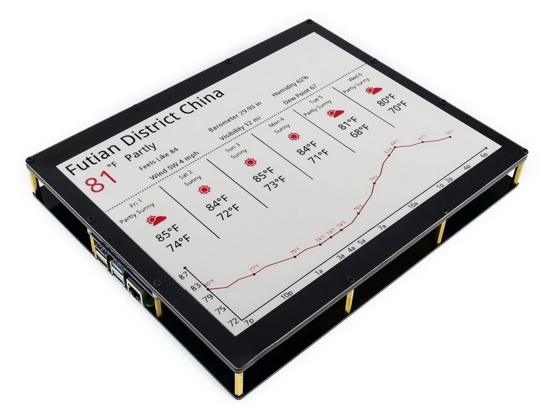

<p align="center">
    
</p>

# Install

```sh
git clone https://github.com/neuromorphicsystems/epaper.git
cd epaper
pip3 install -r requirements.txt
```

# Documentation

The ePaper display has __1304__ by __984__ pixels. Each pixel can be either __black__, __white__ or __red__. Power is only required when updating the display. An display update takes several seconds.

## Python interface

The Python interface consists of a single file: *scripts/epaper.py*. To display an image, use:
```py
import epaper

epaper.show('/dev/ttyACM0', '/path/to/file.png')
```

`'/dev/ttyACM0'` must be replaced with the display's serial port, specific to your machine. This name may change after un-plugging the USB cable. The serial name is generally `'COM*'` on Windows (where `*` is a number), and `'/dev/tty.usbserial-*'` on macOS (where `*` is a string).

The image must have `1304 x 984` pixels, and must be encoded in a format supported by the [Pillow library](https://pillow.readthedocs.io/en/stable/handbook/image-file-formats.html). The following rules apply to display the frame:
- grey levels in the range `[0, 32[` are mapped to __black__
- grey levels in the range `[32, 222]` are mapped to __red__
- grey levels in the range `]222, 255]` are mapped to __white__
- colour frames are converted to grey levels before being submitted to the previous rules; thus, colour frames with only `#000000` (black), `#ff0000` (red) and `#ffffff` (white) pixels are displayed as expected

The `epaper.show` function blocks until the display is completely updated, which typically takes several seconds.

`epaper.width` and `epaper.height` return the width and height of the display (in pixels).

If you plan to display a sequence of images, you can open a sustained connection, which results in slightly faster updates:

```py
import epaper

with open('/dev/ttyACM0') as display:
    # call multiple functions
```

The `display` object has two methods:
- `display.show(filename)` loads and displays the image file at the given path
- `display.send(frame)` displays a numpy array containing pixel values

Both methods will block until the display is fully updated, and use the same rules as `epaper.show`.

The frame provided to `display.send` must be a `numpy.array` with `shape == (984, 1304)` and `dtype == numpy.uint8`.

The file *scripts/example.py* demonstrates the use of all `epaper.show`, `display.show` and `display.send`.

## Hardware documentation

- https://www.waveshare.com/12.48inch-e-Paper-Module-B.htm
- https://www.waveshare.com/wiki/12.48inch_e-Paper_Module_(B)
- https://www.waveshare.com/wiki/UNO_PLUS


# Contribute

Instead of the usual Arduino libraries and compiler, this project uses the AVR compiler directly. The added complexity provides more control over the USART and SPI buses. Run the following commands to install the compiler and the flash tool:

- __Debian / Ubuntu__:
  ```sh
  sudo apt install gcc-avr
  sudo apt install binutils-avr
  sudo apt install avr-libc
  sudo apt install avrdude
  ```

- __macOS__:
  ```sh
  brew tap osx-cross/avr
  brew install avr-libc
  brew install avrdude
  ```

The code can be compiled with:
```sh
make
```

Flash the Arduino with:
```sh
make flash
```
You can change the Arduino device name in *Makefile*.

Format the source code with:
```sh
clang-format -i source/epaper.c
```
